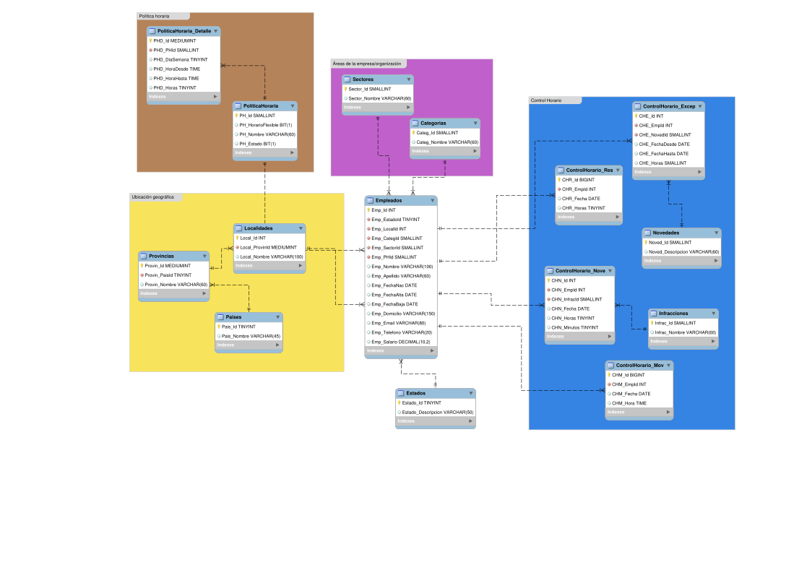
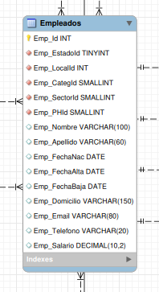
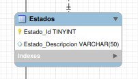
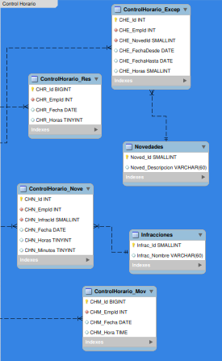
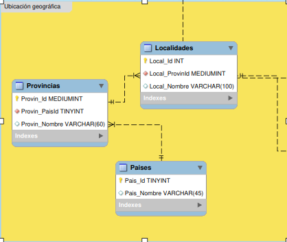
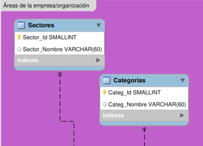
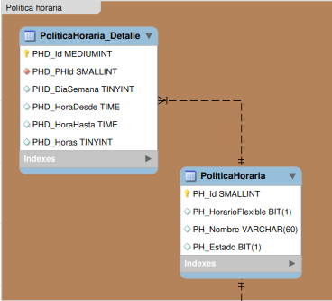

# Base de Datos - Sistema Horarios

Esta base de datos está diseñada para almacenar y gestionar data procedente de los movimientos en un sistema de horarios de trabajo en una empresa u organización.

La base de datos comprende todos los elementos esenciales a tomar en cuenta en la mayoría de los sistemas de horarios complejos, lo que permitirá almacenar y obtener información relevante para la gestión del sistema de horarios, así como para la toma de decisiones en el proceso de control de recursos humanos.

## Tecnologías utilizadas

+ `mysql-community 0.0.35`
+ `fedora-workstation 38`
+ `bash 5.2.21`

## Instalación

Primero clona este repo

```bash
# clona el repo
git clone git@github.com/JhonatanMustiolaCas/sistema-horarios.git
# entra en el directorio src
cd sistema-horarios/src/
```

Luego configura tus datos de acceso a tu usario de mysql en el archivo `config.cnf`

```conf
[client]
user="usuario"
password="contraseña"
host="servidor"
```

Ejecuta el script `setup.sh`

```bash
# Otorgar permiso de ejecución al usuario
sudo chmod u+x ./setup.sh
# Ejecutar script
./setup.sh
```

También puedes hacerlo manualmente desde mysql-cli o desde tu cliente de MySQL. MySQL Workbench recomendado.

>[!Info]
> Los nombres de los sql scripts tienen un prefijo numérico que indica el orden en que deben ser ejecutados

## Prevista



Este es un panorama general del diseño de la base de datos. En la misma se pueden notar divisiones, las cuales se detallarán a después de esta sección.

****
|Tabla|Descripción|
|---|---|
|Empleados|Contiene información esencial sobre los empledos. Es la tabla más importante por ser el punto de convergencia de las demás|
|Estados|Contiene todos los estados posibles en la que un empleado se puede encontrar en x empresa (suspendido, despedido, activo, etc)|
|Paises|Contiene todos los países posibles de los que una empresa puede contratar o ha contratado personal|
|Provincias|Contiene las provincias vinculadas a los países en la tabla Países|
|Localidades|Contiene las localidades vinculadas a las provincias en la tabla Provincias|
|PoliticaHoraria|Contiene las información base de las políticas horarias que se manejan en x empresa|
|PoliticaHorariaDetalle|Contiene la información detallada de cada política horaria en la tabla PolíticaHoraria|
|Categorias|Contiene las categorías de empleados que se manejan en x empresa. También llamado rol o cargo|
|Sectores|Contiene los sectores en que x empresa está esquematizada. También llamado departamentos o áreas|
|Infracciones|Contiene las infracciones que se manejan en x empresa, y que están en violación directa con las políticas horarias|
|Novedades|Contiene los tipos de novedades que se manejan en x empresa para exceptuar comportamientos aparentemente en contra de las políticas horarias, como vacaciones, permisos, reposo, etcétera|
|ControlHorario_Nove|Contiene información sobre infracciones cometidas en contra de las políticas horarias: quién, cuándo, cuál (infracción)|
|ControlHorario_Excep|Contiene información sobre comportamiento horario que debe ser exceptuado: quién, cuándo, cuál (novedad)|
|ControlHorario_Mov|Contiene información sobre los movimientos de los empleados. Se usa para registro de transacciones horarias durante las horas hábiles, como entrada, recesos, y salida (las cuales se tratarían en x sistema)|
|ControlHorario_Res|Contiene información resumida de los movimientos en el horario. Horas totales trabajadas en x fecha, por empleado|

## Detalles

Tabla *Empleados*



****

****

Tabla *Estados*



****

Sección *Control de Horario*



****

Sección *Ubicación geográfica*



****

Sección *Sectores o áreas de la empresa*



****

Sección *Política Horaria*



## Contribuir

Pronto empezaré a agregarle funciones, procedimientos almacendos, eventos y otras cosas. Agregando cualquiera de esas funcionalidades.

+ Define una funcionalidad en un sql script
+ Clona este repo y pruéba añadirlo en la BD
+ Si todo va bien, haz una Pull Request en formato `[nombre]-[tipo]-agregar`
+ Cada sql script estará en un directorio con el nombre del tipo: `functions`, `stored-procedures`, `events`, etcétera. Si el directorio no existe deberás crearlo

## Final

+ Dale **star** si te ha gustado y/o sido útil
